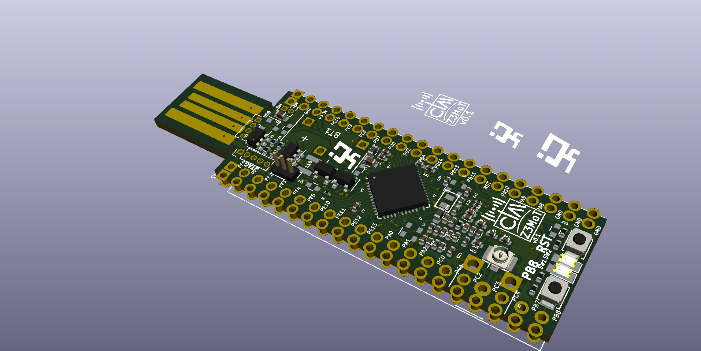

# CIAA-Z3MoT

EZR32 Happy gecko board for QFP48 parts (EZR32HG)
https://www.silabs.com/products/development-tools/wireless/proprietary/slwstk6244a-ezr32-happy-gecko-169-mhz-starter-kit

Kit     	Frequency (MHz) 	Output Power (dBm)   Included Device 
SLWSTK6244A 	169 	         + 20             	 EZR32HG330FG63G
#### Schematic

[Schematic in pdf](ciaa-z3mot.pdf)

#### 3D view

