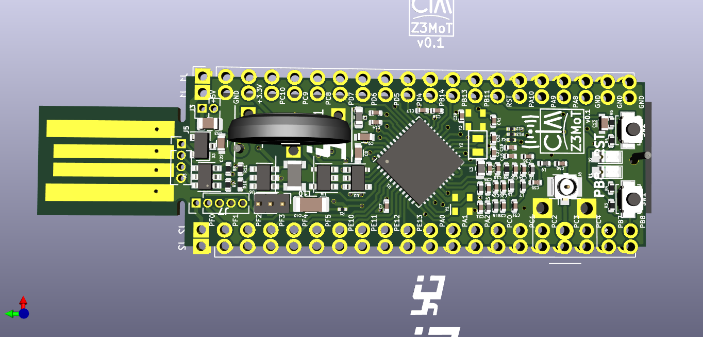
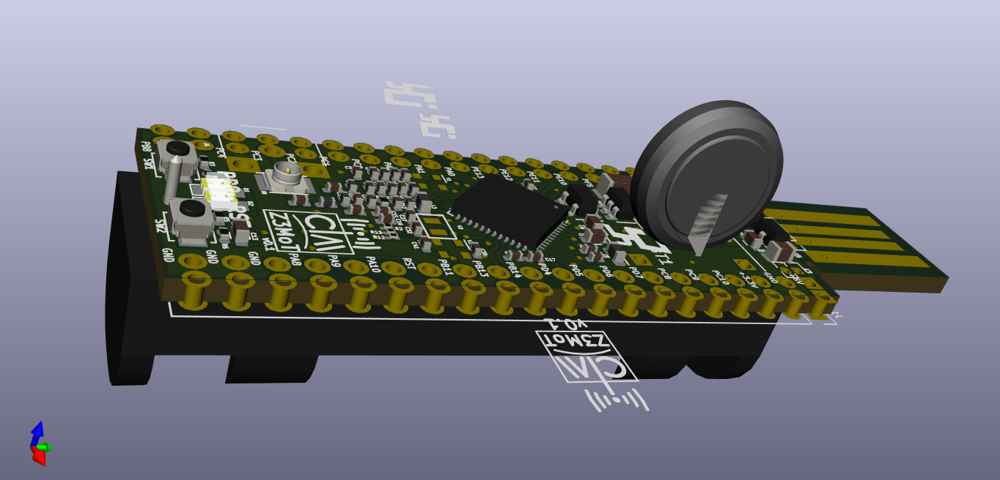
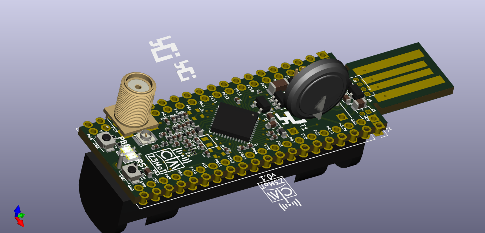
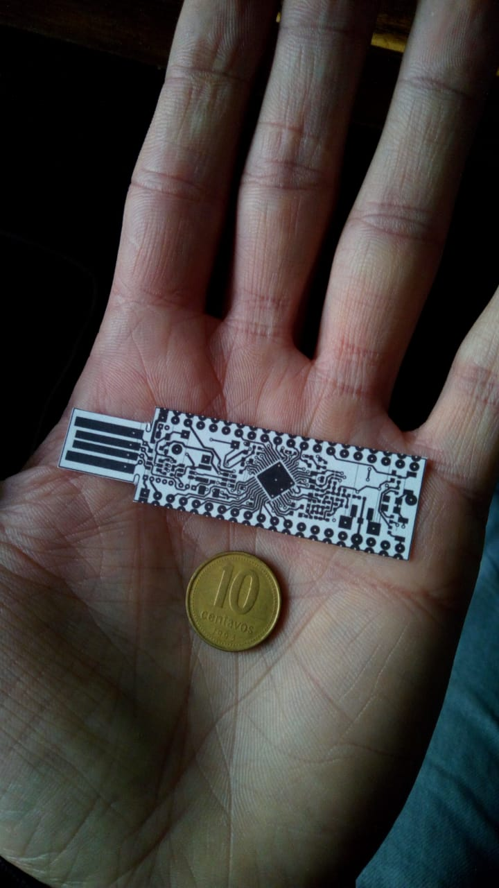

# CIAA-Z3MoT
Simplificación de base board Silabs subGHz :
EZR32 Happy gecko board for QFP48 parts (EZR32HG)
https://www.silabs.com/products/development-tools/wireless/proprietary/slwstk6244a-ezr32-happy-gecko-169-mhz-starter-kit

| Kit        | Frequency(MHz)| Output Power(dBm) |Included Device |
| ------------- |:-------------:| -----:|-----:|
| SLWSTK6244A     | 169 | +20 | ZR32HG330FG63G |

#### Schematic

[Schematic in pdf](ciaa-z3mot.pdf)

#### 3D view

Vista con opciones de bateria y conector RF

