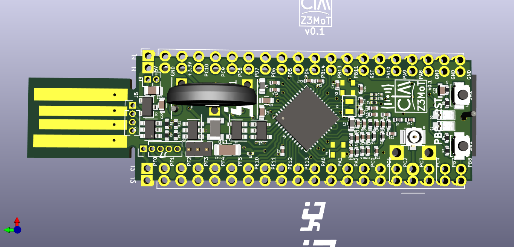
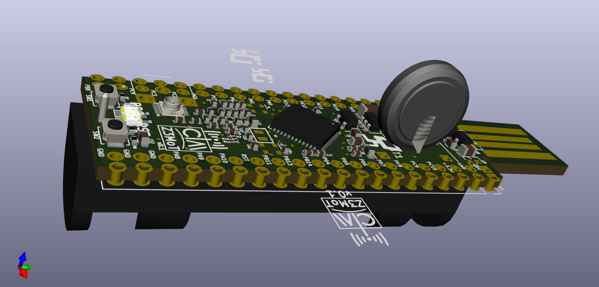
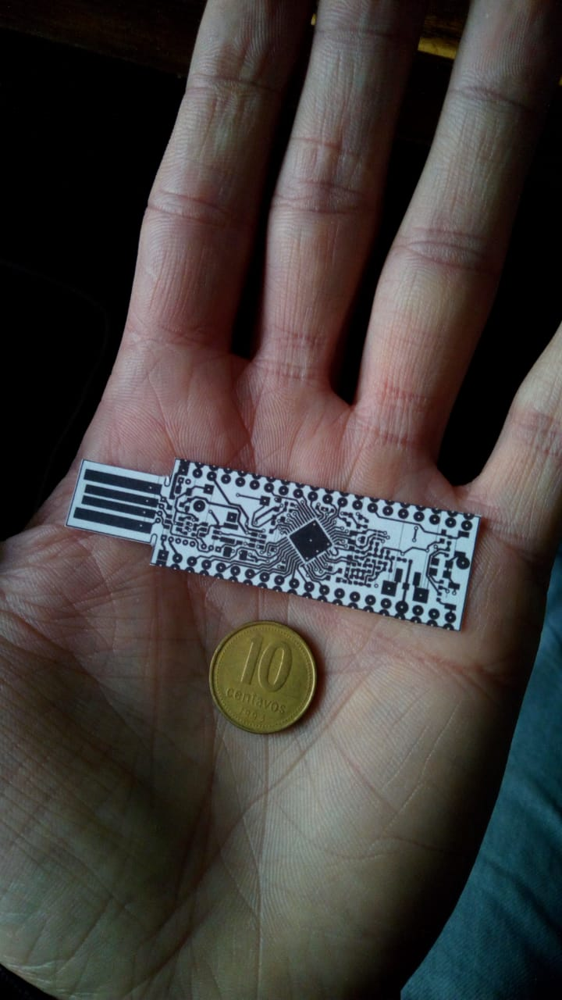

# CIAA-Z3MoT
Simplificación de base board Silabs subGHz :
EZR32 Happy gecko board for QFP48 parts (EZR32HG)
[SLWSTK6244A](https://www.silabs.com/products/development-tools/wireless/proprietary/slwstk6244a-ezr32-happy-gecko-169-mhz-starter-kit)

| Kit        | Frequency(MHz)| Output Power(dBm) |Included Device |
| ------------- |:-------------:| -----:|-----:|
| SLWSTK6244A     | 169 | +20 | ZR32HG330FG63G |

#### Caracteristicas

* Adaptación de [CIAA-Z3R0](http://www.proyecto-ciaa.com.ar/devwiki/doku.php?id=desarrollo:ciaa-z3r0) hacia un enfoque de [MoTe](https://en.wikipedia.org/wiki/Sensor_node).

* Los pines entre Z3R0 y Z3MoT són compatibles en cierto grado, con excepción de los destinados a la interface RF.

* Puertos y pines deprecados de la versión Z3RO a la Z3MoT:
  - A:2,8,9,10. 
  - C:0,1,2,3,4. 

* Introduce 4 GPIO: 
Se utilizan 3 lineas para configurar puerto I2C para memoria EEPROM y posibles MEMs(disponibles V2.0,temperatura,humedad,7DOF,Altímetro-barómetro,luxómetro)

Deja un GPIO libre configurable sobre los restantes puertos:
- A:0,1.
- B:7,8,11,13,14.
- C:8,9,10,14,15.
- D:4,5,6,7.
- E:10,11,12,13.
- F:0,1,2,3,4.

* USB:
El conector usb se modifico, no se utiliza conector soldable. Se implemento un plug en pcb USB A troquelable, brindando la posiblidad soldar tira de pines de paso 1,27" o soldar en PCB tipo castellated.

* Alimentación:
Selección mediante jumper permitiendo conmutar bateria o (USB / PCBtarget).
La alimentación mediante bateria se implemento con fuente DC/DC tipo boost.

* Autonomía:
El stick Z3MoT tiene la posiblidad de usar baterias tipo boton CR2032(3V)(1,8 años autonomia 225 mAh) o mediante Pila AAA(7,25 años 1,5V de 900-1155 mAh). 

* Conectores RF:
Es posible utilizar dos tipos de conectores uno SMD(por defecto) y otro SMA(soldando via).

* JTAG:
Los pines utilizados en Z3RO son los mismos que para Z3MoT. Se adiciona tira de pines para conexión ordenada de JTAG  mediante sondas con resortes montadas sobre una pinza o base con balancin.
 

#### Schematic

[Schematic in pdf](ciaa-z3mot.pdf)

#### 3D view

## Vista con opciones de bateria y conector RF

## Video (YOUTUBE)

